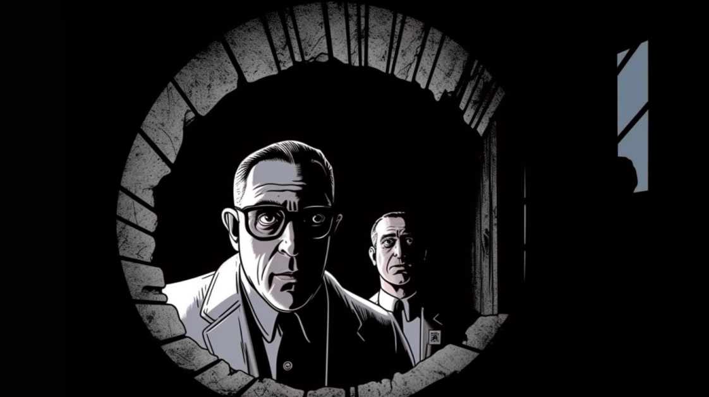
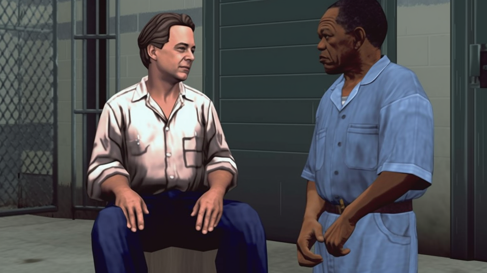
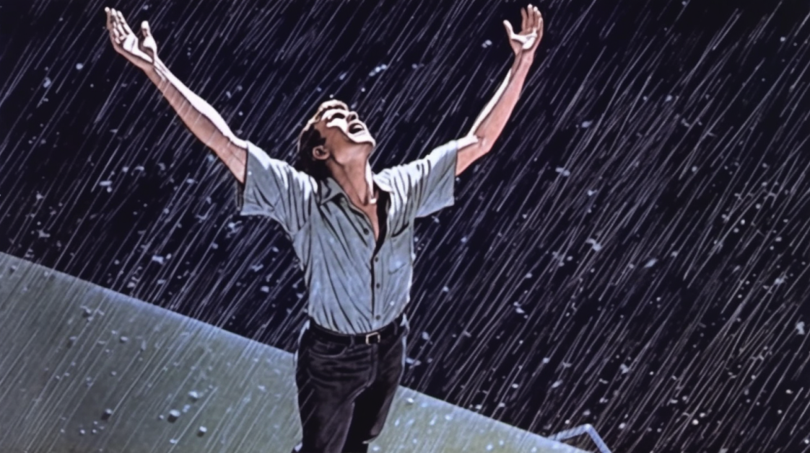

# Remake game

## About 
Remake is the ultimate movie guessing game where players can put their movie knowledge to the test and challenge their guessing skills. The aim is to guess the movie based on images generated by the Midjourney AI image generator.

### Rules: 
- Three chances to guess the movie, each incorrect guess, the new AI image is revealed
- Aim for the highest number of guessed movies with the lowest number of attempts

  
  
  

### Features
- New movie challenge everyday
- Access to previous day's challenges
- Tracked number of movies guessed correctly
- Record of the number of attempts taken for each movie

## Project Structure
The project follows the MERN (MongoDB, Express, React, Node.js) stack for building the Remake movie guessing game.

The `client` folder contains the frontend code built with React. 

The `server` folder contains the backend code built with Node.js and Express. This includes the API endpoints, database connections, and business logic required to handle requests from the client and perform server-side operations. 

The MongoDB database is used to store movies data and user statistics. The database stores information about the movies available for guessing, user details, scores, and other relevant statistics. 
